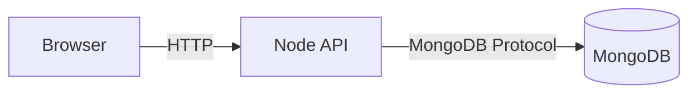

# PROG 2700: Week 6 - Docker & Microservices

---

## Agenda

1.  Introduction to Docker in Development
2.  Setting up a Node.js + MongoDB Environment
3.  Containerizing the Backend
4.  Connecting Services with Docker Compose
5.  Consuming the API with a Frontend
6.  Exploration & Lab Time

---

## 1. Why Docker?

-   **Consistency**: "It works on my machine" -> "It works everywhere".
-   **Isolation**: Dependencies don't conflict.
-   **Simplicity**: Spin up databases (Mongo, SQL) without messy local installs.

---

## 2. Our Stack

-   **Backend**: Node.js + Express
-   **Database**: MongoDB (Official Image)
-   **Orchestration**: Docker Compose
-   **Frontend**: Plain HTML/JS (Client Implementation)

---

## Architecture Diagram



---

## 3. The `Dockerfile`

```dockerfile
FROM node:18-alpine
WORKDIR /app
COPY package*.json ./
RUN npm install
COPY . .
EXPOSE 3000
CMD [ "npm", "start" ]
```

-   **FROM**: Base image.
-   **WORKDIR**: Where our app lives inside the container.
-   **COPY**: Putting our code in.
-   **RUN**: Installing libraries.

---

## 4. Docker Compose (`docker-compose.yml`)

```yaml
services:
  prog2700-mongo:
    image: mongo
    ports:
      - "27017:27017"

  prog2700-backend:
    build: ./backend_docker
    depends_on:
      - prog2700-mongo
    ports:
      - "3000:3000"
```

-   Defines **Two Services**: `prog2700-mongo` and `prog2700-backend`.
-   **Service Name Resolution**: The backend connects to `mongodb://prog2700-mongo:27017`.

---

## 5. Activity: Let's Run It!

1.  Navigate to `Week6` folder.
2.  Run: `docker-compose up --build`
3.  Check Swagger: `http://localhost:3000/api-docs`
4.  Check Frontend: Open `frontend_client/index.html`

---

## 6. Resources

-   [Docker Desktop](https://www.docker.com/products/docker-desktop/)
-   [MongoDB Compass](https://www.mongodb.com/try/download/compass)
-   [Postman](https://www.postman.com/downloads/)
